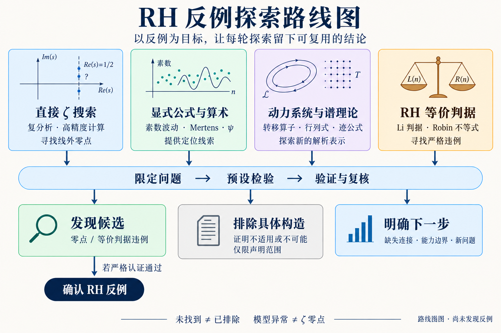

# RH 反例探索：四条路线与可复用结果

2026-09-16。目标是找到并严格确认 RH 反例；既有实验与证明探索作为参考，不决定必须沿用的路线。本图是探索方案，不是已完成的理论链条，也不启动新实验。

## 四条路线

| 路线 | 核心问题 | 当前角色与必要边界 |
| --- | --- | --- |
| 直接 ζ 搜索 | 能否在明确区域找到稳定的线外零点？ | 主线；数值求根后仍须严格认证。不要求先完成算术探测器或 Hilbert–Pólya 构造。 |
| 显式公式与算术 | 素数、Mertens、ψ 的响应能否帮助定位零点？ | 辅助线索；先验证响应关系和探测能力，不能把单通道异常当作零点。 |
| 动力系统与谱理论 | 转移算子、行列式、迹公式能否给出有用的新表示？ | 理论探索；模型与实际 ζ 的关系须明确证明。模型零点、构造失败或自伴性失败均不能直接否定 RH。 |
| RH 等价判据 | 能否找到并严格证明适用范围内的判据违例？ | 独立备选路线；核验等价定理的全部条件与误差界。无需先把违例转换为显式零点坐标。 |

动力学方向参考用户提供的 `manuscript-v1.pdf`（21 页），尤其第 5–6 页、11 页及附录 A。文章汇总的局部成果尚未在本次工作中独立重证；其“同一对象”原则用于约束推理，不将原证明项目的全部执行流程移植为本项目规则。已有谱实验属于第二条路线的发展材料。

## 每轮开始前写清楚

一个具体问题、研究对象与假设；允许的参数或搜索范围；什么结果能支持或否定所测命题；复核方法；停止条件与计算预算。四条路线不等于同时运行四个长批次。

## 三种有价值的出口

1. **发现候选。** 给出可复现的零点位置或等价判据违例，进入独立复核和严格认证。只有认证成功才升级数学结论。
2. **排除具体构造。** 用证明或足够严格的认证，排除一个定义清楚的构造、机制或区域；结论保留其假设与适用范围。
3. **明确下一步。** 给出具体缺失的引理、误差控制、可辨识性条件，或在已声明测试条件下的检测能力，并提出能决定去留的后续检验。

“有限搜索未找到”“某检测方法在某种注入上失效”“运行预算耗尽”必须分别记录。普通有限采样不能认证一个连续区域无零点；一个模型的失败也不能排除整个数学方向。若只留下运行记录，就如实标注，不能包装成上述三类数学进展。

未确认反例时，本项目仍可积累范围明确的排除结果、可复用方法、失败机制和下一步问题；这些才是后续研究能够使用的结论。

## 图像来源

- 使用内置 imagegen 生成，再以同一工具修订可读性和临界线标注；未改动原 PDF。
- [初始生成提示词](assets/rh-counterexample-roadmap-v2.prompt.txt)；[最终修订提示词](assets/rh-counterexample-roadmap-v2.edit-prompt.txt)。
- 最终 PNG SHA-256：`3d328bae71301eebc6bfb02b12ff8eda9d0d131ce0b810ced202197d1b8dc775`。
- 图仅表示方向与判断流程；底层证据仍以原始证明、数据和认证记录为准。

判据文献入口：[Li 原论文](https://doi.org/10.1006/jnth.1997.2137)讨论其正性判据；[Lagarias 的论文](https://websites.umich.edu/~lagarias/doc/elementaryrh.pdf)给出等价不等式并说明 Robin 结果。这里只列作路线来源，不声称已有违例。
