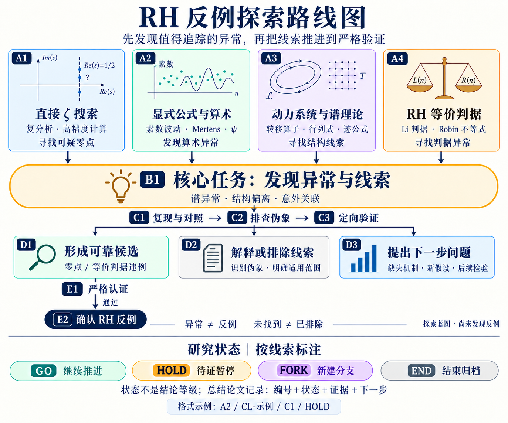

# RH 反例探索：以发现异常与线索为核心

2026-09-16。最终目标是找到并严格确认 RH 反例；当前探索的核心任务是发现值得追踪的异常与线索。既有实验与证明探索作为参考，不决定必须沿用的路线。本图是探索方案，不是已完成的理论链条，也不启动新实验。

## 固定位置编号

编号表示研究位置，不表示完成状态、数学结论强度或整个项目的完成比例。同一方向可以有多条线索，分别处于不同位置。完整引用前缀为 `RC:`，图中省略前缀以保持简洁；例如 `RC:A1`。这些编号与 `manuscript-v1.pdf` 的 Hilbert–Pólya A0/A1/B1 等理论门槛，以及旧实验 Phase A/B/C、G1–G4 均属不同体系，不可直接换算或继承结论。

| 编号 | 对应位置 |
| --- | --- |
| A1 | 直接 ζ 搜索 |
| A2 | 显式公式与算术 |
| A3 | 动力系统与谱理论 |
| A4 | RH 等价判据 |
| B1 | 发现异常与线索（核心任务） |
| C1 | 复现与对照 |
| C2 | 排查伪象 |
| C3 | 定向验证 |
| D1 | 形成可靠候选（仍未认证） |
| D2 | 解释或排除线索 |
| D3 | 提出下一步问题 |
| E1 | 严格认证 |
| E2 | 确认 RH 反例（仅在认证通过后） |

后续记录采用：`方向编号｜线索编号｜当前位置｜研究状态｜证据｜下一步检验`。例如 `A2｜CL-示例｜C1｜HOLD｜证据路径｜换网格复现`，只是格式示例，不代表已有新线索或当前状态。

研究决策状态采用下表的 GO / HOLD / FORK / END。若还需描述执行情况，另记“待开展 / 进行中 / 待复核 / 暂停 / 已结束”，不与研究决策混为一列。到达 C1 不等于通过 C1；一个批次结束不等于对应方向研究完成。E1 正在进行不等于 E2 已成立。C1–C3 可以往返，D3 也可产生新的 B1 线索，图仅压缩显示主要流程。

编号自 v4 起固定：新增细分内容使用 `A2.1`、`C1.1` 等子编号，不因图形重排改变旧编号。v5 补充状态标记规范，不将历史批次自动标成通过，也未启动新研究运行。

## 研究状态与总结论文标记

| 状态 | 图中含义 | 必须一并记录 |
| --- | --- | --- |
| GO | 继续推进 | 为什么值得继续；下一项明确检验及范围；仍未解决的问题。GO 不表示当前节点已证明，也不表示进程正在运行。 |
| HOLD | 待证暂停 | 缺少的证据、条件或依赖，以及恢复推进的具体条件。HOLD 不等于方向失败。 |
| FORK | 新建分支 | 原对象与新对象的差别、父子线索编号、允许复用的证据及重新检验的连接。新分支不继承未经证明的结论。 |
| END | 结束归档 | 本轮结论、证据、停止原因及适用范围；区分成功完成、有限未检出、方法失效、严格排除和预算结束。END 不自动代表否定性数学结论。 |

四个标记是互不排序的研究处置，不是 GO→HOLD→FORK→END 的阶段链。标记绑定具体线索/对象、所在节点与日期，不给整条方向自动贴同一个状态；尚未评估的条目保持“未标记”。状态变化保留前后记录、依据和版本，图中的格式示例不是项目状态声明。

后续总结论文在相应小节、图注或结果表中标注 `方向 / 线索编号 / 节点 / 状态`，并注明截至日期与证据版本。正文按“发现了什么—怎样检验—能得出什么—不能得出什么—下一步”组织。研究结果类别独立写明为有限数值筛查、模型/surrogate 对照、实际 ζ 数值候选、严格证明/区间认证等，不能由状态代码代替。

可直接使用[研究总结条目模板](RESEARCH_SUMMARY_TEMPLATE.md)。本轮建立的是标记规范，没有替历史成果补做研究判断，也没有创建完成的总结论文。

## 核心过程：发现线索，再逐步验证

四条路线都先问：有没有相对于明确基线的异常、解释不了的结构，或值得检验的新关联？优先寻找能导出具体预测、缩小搜索范围或提出可检验机制的线索。探索可以提出新假设，不要求每条初始观察已经满足最终认证条件。

线索可以来自单通道、一个模型或局部观察；先记录对象、位置、基线、效应、来源，以及它为什么值得继续追踪。随后用复现、对照、精度或尺度变化和理论分析区分伪象与稳定现象。稳定也不自动等于与 RH 有关，仍须检查与实际 ζ 或等价判据的联系。

当前算术筛查的跨通道、跨网格、跨尺度和 control 门槛仍约束向实际 ζ 求根器的移交；它们不是禁止记录早期线索的条件。直接 ζ 搜索和等价判据探索按各自标准验证。

因此主线是：**发现异常与线索 → 复现与对照 → 排查伪象 → 定向验证 → 有条件地形成候选并严格认证。** 排除结果和方法边界是沿途有价值的产出，不替代发现线索这一核心目标。

## 四条路线

| 路线 | 核心问题 | 当前角色与必要边界 |
| --- | --- | --- |
| 直接 ζ 搜索 | 能否在明确区域找到稳定的线外零点？ | 主线；数值求根后仍须严格认证。不要求先完成算术探测器或 Hilbert–Pólya 构造。 |
| 显式公式与算术 | 素数、Mertens、ψ 的响应能否帮助定位零点？ | 辅助线索；先验证响应关系和探测能力，不能把单通道异常当作零点。 |
| 动力系统与谱理论 | 转移算子、行列式、迹公式能否给出有用的新表示？ | 理论探索；模型与实际 ζ 的关系须明确证明。模型零点、构造失败或自伴性失败均不能直接否定 RH。 |
| RH 等价判据 | 能否找到并严格证明适用范围内的判据违例？ | 独立备选路线；核验等价定理的全部条件与误差界。无需先把违例转换为显式零点坐标。 |

动力学方向参考用户提供的 `manuscript-v1.pdf`（21 页），尤其第 5–6 页、11 页及附录 A。文章汇总的局部成果尚未在本次工作中独立重证；其“同一对象”原则用于约束推理，不将原证明项目的全部执行流程移植为本项目规则。已有谱实验属于第二条路线的发展材料。

## 每轮开始前写清楚

一个具体问题、研究对象与假设；允许的参数或搜索范围；什么结果能支持或否定所测命题；复核方法；停止条件与计算预算。四条路线不等于同时运行四个长批次。

## 三种有价值的出口

1. **形成可靠候选。** 从经检验的线索推进到可复现的可疑零点或等价判据违例，进入独立复核和严格认证。只有认证成功才升级数学结论。
2. **解释或排除线索。** 确认某个异常源于伪象、已知机制或方法局限，明确其适用范围。若要进一步声称排除一个构造、机制或区域，须提供相应证明或严格认证。
3. **提出下一步问题。** 把尚未解释的线索转化为具体假设、缺失引理或判别实验；注明误差控制、可辨识性条件或检测能力，并提出能决定去留的后续检验。

“有限搜索未找到”“某检测方法在某种注入上失效”“运行预算耗尽”必须分别记录。普通有限采样不能认证一个连续区域无零点；一个模型的失败也不能排除整个数学方向。若只留下运行记录，就如实标注，不能包装成上述三类数学进展。

未确认反例时，本项目仍可积累可追踪的异常线索、范围明确的排除结果、可复用方法、失败机制和下一步问题。未经解释的观察保持线索标签，不包装为已验证候选。

## 图像来源

- 使用内置 imagegen 生成并编辑；v5 保留 v4 的固定位置编号，并添加独立的研究状态图例与论文标记格式；未改动原 PDF。
- [v5 完整编辑提示词](assets/rh-counterexample-roadmap-v5.prompt.txt)。
- v5 PNG SHA-256：`133a899f5964e88bc6daeb0acffeb61a4e3a4b3fca8152b1e663dd7d8beb9725`。
- 历史 v4 的[提示词](assets/rh-counterexample-roadmap-v4.prompt.txt)和[图片](assets/rh-counterexample-roadmap-v4.png)保留；其 PNG SHA-256 为 `9ed4da935561ccce94471b0c31dd070e65f9a6d06055b96ac47d79baf8d9a42b`。
- 历史 v3 的[提示词](assets/rh-counterexample-roadmap-v3.prompt.txt)和[图片](assets/rh-counterexample-roadmap-v3.png)保留；其 PNG SHA-256 为 `02c79da6d33200e124fa63886833a5cd4fd8f2eea6f6d2c98e5790fb18fc7371`。
- 历史 v2 的[初始生成提示词](assets/rh-counterexample-roadmap-v2.prompt.txt)、[可读性修订提示词](assets/rh-counterexample-roadmap-v2.edit-prompt.txt)和[图片](assets/rh-counterexample-roadmap-v2.png)保留供追溯。
- 图仅表示方向与判断流程；底层证据仍以原始证明、数据和认证记录为准。

判据文献入口：[Li 原论文](https://doi.org/10.1006/jnth.1997.2137)讨论其正性判据；[Lagarias 的论文](https://websites.umich.edu/~lagarias/doc/elementaryrh.pdf)给出等价不等式并说明 Robin 结果。这里只列作路线来源，不声称已有违例。
