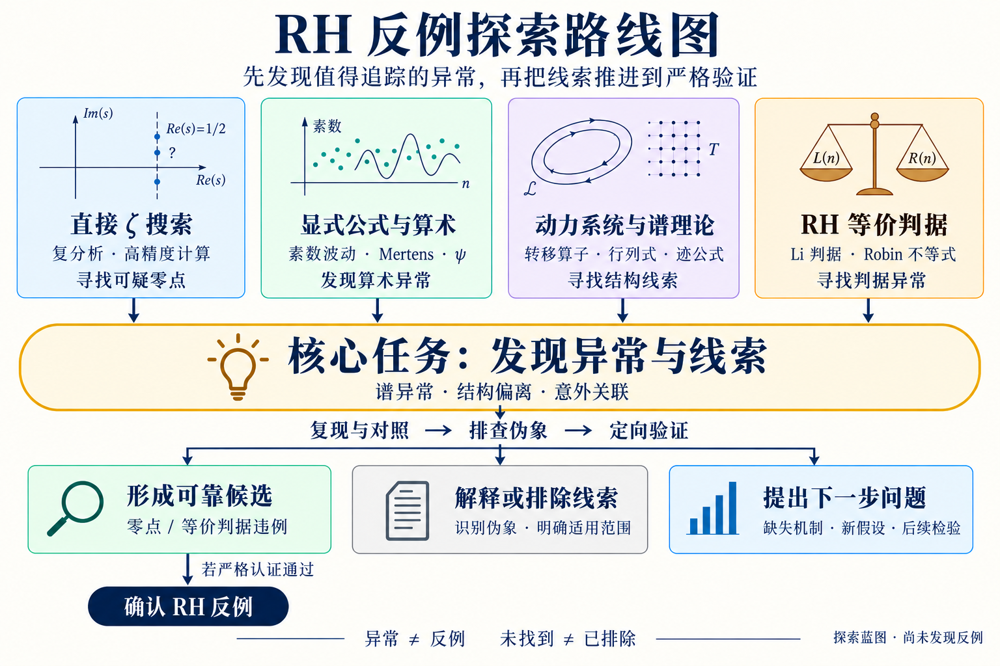

# RH 反例探索：以发现异常与线索为核心

2026-09-16。最终目标是找到并严格确认 RH 反例；当前探索的核心任务是发现值得追踪的异常与线索。既有实验与证明探索作为参考，不决定必须沿用的路线。本图是探索方案，不是已完成的理论链条，也不启动新实验。

## 核心过程：发现线索，再逐步验证

四条路线都先问：有没有相对于明确基线的异常、解释不了的结构，或值得检验的新关联？优先寻找能导出具体预测、缩小搜索范围或提出可检验机制的线索。探索可以提出新假设，不要求每条初始观察已经满足最终认证条件。

线索可以来自单通道、一个模型或局部观察；先记录对象、位置、基线、效应、来源，以及它为什么值得继续追踪。随后用复现、对照、精度或尺度变化和理论分析区分伪象与稳定现象。稳定也不自动等于与 RH 有关，仍须检查与实际 ζ 或等价判据的联系。

当前算术筛查的跨通道、跨网格、跨尺度和 control 门槛仍约束向实际 ζ 求根器的移交；它们不是禁止记录早期线索的条件。直接 ζ 搜索和等价判据探索按各自标准验证。

因此主线是：**发现异常与线索 → 复现与对照 → 排查伪象 → 定向验证 → 有条件地形成候选并严格认证。** 排除结果和方法边界是沿途有价值的产出，不替代发现线索这一核心目标。

## 四条路线

| 路线 | 核心问题 | 当前角色与必要边界 |
| --- | --- | --- |
| 直接 ζ 搜索 | 能否在明确区域找到稳定的线外零点？ | 主线；数值求根后仍须严格认证。不要求先完成算术探测器或 Hilbert–Pólya 构造。 |
| 显式公式与算术 | 素数、Mertens、ψ 的响应能否帮助定位零点？ | 辅助线索；先验证响应关系和探测能力，不能把单通道异常当作零点。 |
| 动力系统与谱理论 | 转移算子、行列式、迹公式能否给出有用的新表示？ | 理论探索；模型与实际 ζ 的关系须明确证明。模型零点、构造失败或自伴性失败均不能直接否定 RH。 |
| RH 等价判据 | 能否找到并严格证明适用范围内的判据违例？ | 独立备选路线；核验等价定理的全部条件与误差界。无需先把违例转换为显式零点坐标。 |

动力学方向参考用户提供的 `manuscript-v1.pdf`（21 页），尤其第 5–6 页、11 页及附录 A。文章汇总的局部成果尚未在本次工作中独立重证；其“同一对象”原则用于约束推理，不将原证明项目的全部执行流程移植为本项目规则。已有谱实验属于第二条路线的发展材料。

## 每轮开始前写清楚

一个具体问题、研究对象与假设；允许的参数或搜索范围；什么结果能支持或否定所测命题；复核方法；停止条件与计算预算。四条路线不等于同时运行四个长批次。

## 三种有价值的出口

1. **形成可靠候选。** 从经检验的线索推进到可复现的可疑零点或等价判据违例，进入独立复核和严格认证。只有认证成功才升级数学结论。
2. **解释或排除线索。** 确认某个异常源于伪象、已知机制或方法局限，明确其适用范围。若要进一步声称排除一个构造、机制或区域，须提供相应证明或严格认证。
3. **提出下一步问题。** 把尚未解释的线索转化为具体假设、缺失引理或判别实验；注明误差控制、可辨识性条件或检测能力，并提出能决定去留的后续检验。

“有限搜索未找到”“某检测方法在某种注入上失效”“运行预算耗尽”必须分别记录。普通有限采样不能认证一个连续区域无零点；一个模型的失败也不能排除整个数学方向。若只留下运行记录，就如实标注，不能包装成上述三类数学进展。

未确认反例时，本项目仍可积累可追踪的异常线索、范围明确的排除结果、可复用方法、失败机制和下一步问题。未经解释的观察保持线索标签，不包装为已验证候选。

## 图像来源

- 使用内置 imagegen 生成并编辑；v3 在 v2 基础上将发现异常与线索突出为核心任务；未改动原 PDF。
- [v3 完整编辑提示词](assets/rh-counterexample-roadmap-v3.prompt.txt)。
- v3 PNG SHA-256：`02c79da6d33200e124fa63886833a5cd4fd8f2eea6f6d2c98e5790fb18fc7371`。
- 历史 v2 的[初始生成提示词](assets/rh-counterexample-roadmap-v2.prompt.txt)、[可读性修订提示词](assets/rh-counterexample-roadmap-v2.edit-prompt.txt)和[图片](assets/rh-counterexample-roadmap-v2.png)保留供追溯。
- 图仅表示方向与判断流程；底层证据仍以原始证明、数据和认证记录为准。

判据文献入口：[Li 原论文](https://doi.org/10.1006/jnth.1997.2137)讨论其正性判据；[Lagarias 的论文](https://websites.umich.edu/~lagarias/doc/elementaryrh.pdf)给出等价不等式并说明 Robin 结果。这里只列作路线来源，不声称已有违例。
